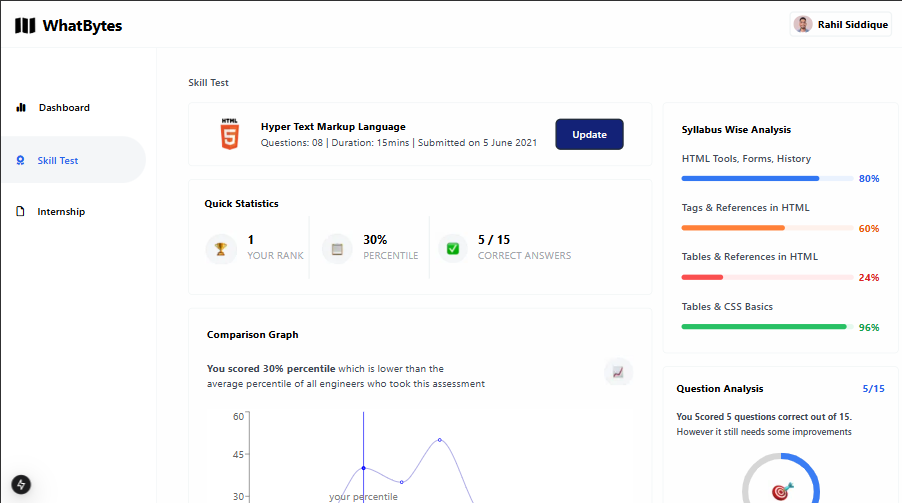

<h1 align="center">Welcome to whatbytes-fe-test 👋</h1>
<p>
  
  <a href="https://twitter.com/Timmi_tech" target="_blank">
    
  </a>
</p>

> Test Assessment submission for Whatbytes frontend intern candidates

### 🏠 [Homepage](https://daniel-oluwole-whatbytes-fe-test.vercel.app/)

## Install

```sh
npm run build
```

## Usage

```sh
npm run dev
```
## Navigating Around
<p>
   Enjoy navigating around the Page
  
</p>


## PS
<p>Page done using Next.js + TailwindCSS</p>
<p>Graph was genereted using react recharts UI library</p>
<p>Circular progress bar was genereted using react-circular-progressbar UI library</p>

## Author

👤 **Oluwole Daniel Oluwatimileyin**

* Website: https://timmi-tech.kesug.com/
* Twitter: [@Timmi\_tech](https://twitter.com/Timmi\_tech)
* Github: [@Tiimmii](https://github.com/Tiimmii)
* LinkedIn: [@tiimmii](https://linkedin.com/in/tiimmii)# Whatbytes
